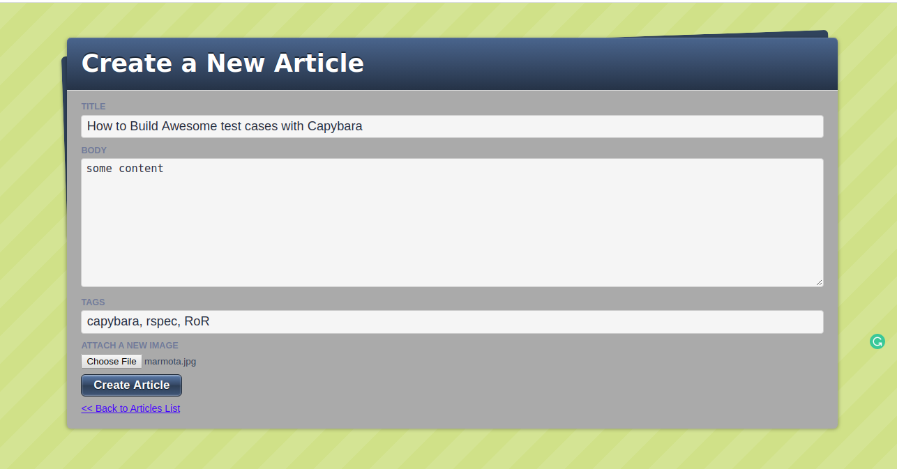
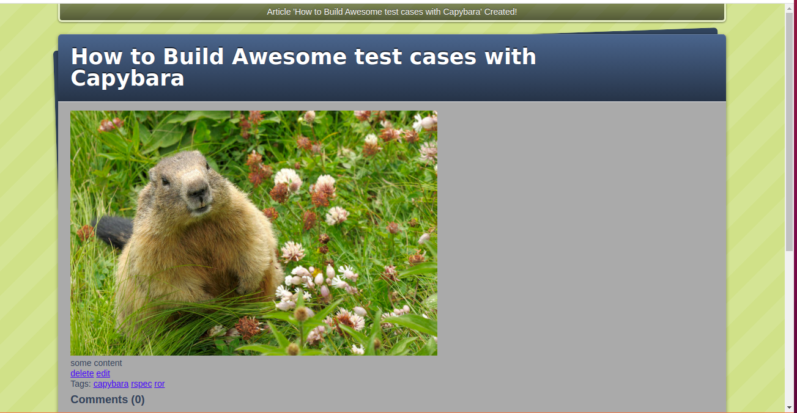
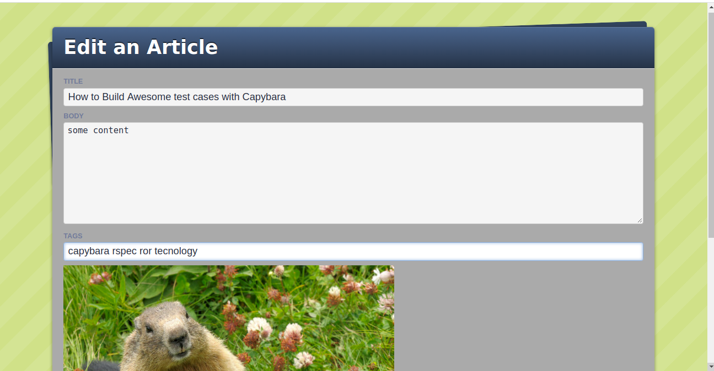
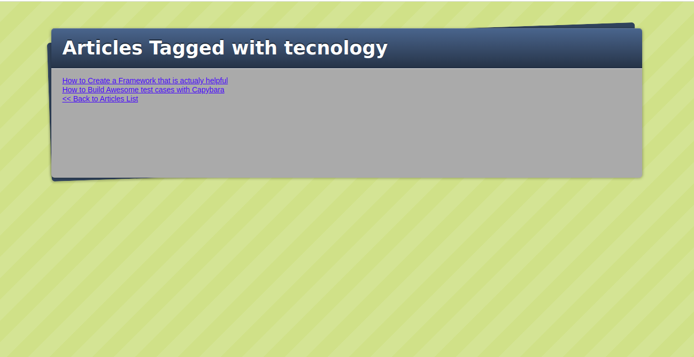
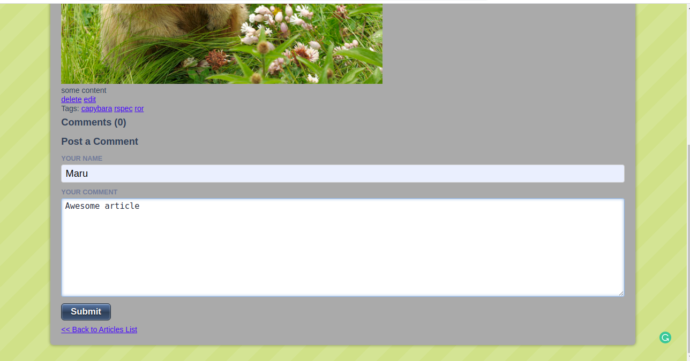
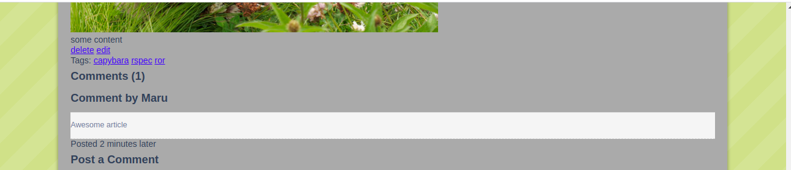

<!--
*** Thanks for checking out this README Template. If you have a suggestion that would
*** make this better, please fork the repo and create a pull request or simply open
*** an issue with the tag "enhancement".
*** Thanks again! Now go create something AMAZING! :D
-->

<!-- PROJECT SHIELDS -->
<!--
*** I'm using markdown "reference style" links for readability.
*** Reference links are enclosed in brackets [ ] instead of parentheses ( ).
*** See the bottom of this document for the declaration of the reference variables
*** for contributors-url, forks-url, etc. This is an optional, concise syntax you may use.
*** https://www.markdownguide.org/basic-syntax/#reference-style-links
-->
[![Contributors][contributors-shield]][contributors-url]
[![Forks][forks-shield]][forks-url]
[![Stargazers][stars-shield]][stars-url]
[![Issues][issues-shield]][issues-url]
[![Heroku][heroku-shield]][heroku-url]


<!-- PROJECT LOGO -->
<br />
<p align="center">
  <a href="https://github.com/rammazzoti2000/blogger">
    
  </a>

  <h3 align="center">Blogger App</h3>

  <p align="center">
    This project is part of the Microverse curriculum in Ruby on Rails module!
    <br />
    <a href="https://github.com/rammazzoti2000/blogger"><strong>Explore the docs »</strong></a>
    <br />
    <br />
    <a href="https://morning-savannah-73840.herokuapp.com/">View Demo</a>
    ·
    <a href="https://github.com/rammazzoti2000/blogger/issues">Report Bug</a>
    ·
    <a href="https://github.com/rammazzoti2000/blogger/issues">Request Feature</a>
  </p>
</p>

<!-- TABLE OF CONTENTS -->
## Table of Contents

* [About the Project](#about-the-project)
  * [Built With](#built-with)
* [Live Version](#live-version)
* [Contact](#contact)
* [Acknowledgements](#acknowledgements)
* [License](#license)

<!-- ABOUT THE PROJECT -->
## About The Project

[![Product Name Screen Shot][product-screenshot]](https://morning-savannah-73840.herokuapp.com/)

This is the third project of the Microverse Ruby on Rails Module. The app has been built following the [jumpstartlab](http://tutorials.jumpstartlab.com/projects/blogger.html#blogger-2) tutorial.

## Built With
This project was built using these technologies.
* Ruby & Ruby on Rails
* SQLite
* JavaScript
* Rubocop
* Atom :atom:
* Paperclip

<!-- ABOUT THE PROJECT -->
## Getting Started
To get a local copy up and running follow these simple example steps.

### Clone or Download
* [Download](https://github.com/rammazzoti2000/blogger/archive/develop.zip) or clone this repo:
  - Clone with SSH:
  ```
    git@github.com:rammazzoti2000/blogger.git
  ```
  - Clone with HTTPS
  ```
    https://github.com/rammazzoti2000/blogger.git
  ```
### Setup

cd to the project:

```cd Blogger-Rails```

Install gems with:

```bundle install```

Setup database with:

```rails db:migrate```

## Usage
Start server with:

```rails server```

Open http://localhost:3000/ in your browser.

### Articles New page
This is THE article's New page (THE tag New form is within this page)


### Articles Show page
This is THE article's show page (THE tag show page is within this page)


### Articles Edit page
This is THE article's Edit page (THE tag Edit form is within this page)


### Tag Search
Click on any tag within AN article Show page


### Comments New 
THE comment's NEW form is within THE article's Show page


### Comments Show
THE comment's Show page is Within THE article's Show page


<!-- LIVE VERSION -->
## Live version

You can see it working [here](https://morning-savannah-73840.herokuapp.com/)

## Automated Test

> There are no automated tests for this project yet

<!-- CONTACT -->
## Contributors

👤 **Roman Nikolaev** 
    
- LinkedIn: [Roman Nikolaev](https://www.linkedin.com/in/roman-nikolaev-65b639197/) - 
- GitHub: [@vzdrizhni](https://github.com/vzdrizhni)
- E-mail: vzdrizhni@gmail.com

👤 **Alexandru Bangau**

- LinkedIn: [Alexandru Bangau](https://www.linkedin.com/in/alexandru-bangau/)
- GitHub: [@rammazzoti2000](https://github.com/rammazzoti2000)
- E-mail: bangau.alexandru@gmail.com

## :handshake: Contributing

Contributions, issues and feature requests are welcome!

Feel free to check the [issues page](https://github.com/rammazzoti2000/blogger/issues).

## Show your support

Give a :star: if you like this project!

<!-- ACKNOWLEDGEMENTS -->
## Acknowledgements
* [Microverse](https://www.microverse.org/)
* [The JumpStartLab Tutorial](http://tutorials.jumpstartlab.com/projects/blogger.html#blogger-2)
* [Ruby Documentation](https://www.ruby-lang.org/en/documentation/)
* [Ruby on Rails](https://rubyonrails.org/)
* [heroku](https://www.heroku.com)

<!-- MARKDOWN LINKS & IMAGES -->
<!-- https://www.markdownguide.org/basic-syntax/#reference-style-links -->
[contributors-shield]: https://img.shields.io/github/contributors/rammazzoti2000/blogger.svg?style=flat-square
[contributors-url]: https://github.com/rammazzoti2000/blogger/graphs/contributors
[forks-shield]: https://img.shields.io/github/forks/rammazzoti2000/blogger.svg?style=flat-square
[forks-url]: https://github.com/rammazzoti2000/blogger/network/members
[stars-shield]: https://img.shields.io/github/stars/rammazzoti2000/blogger.svg?style=flat-square
[stars-url]: https://github.com/rammazzoti2000/blogger/stargazers
[issues-shield]: https://img.shields.io/github/issues/rammazzoti2000/blogger.svg?style=flat-square
[issues-url]: https://github.com/rammazzoti2000/blogger/issues
[heroku-shield]: http://heroku-badge.herokuapp.com/?app=morning-savannah-73840&style=flat
[heroku-url]: https://morning-savannah-73840.herokuapp.com/
[product-screenshot]: app/assets/images/blogger.png

## 📝 License

This project is [MIT](https://opensource.org/licenses/MIT) licensed.
